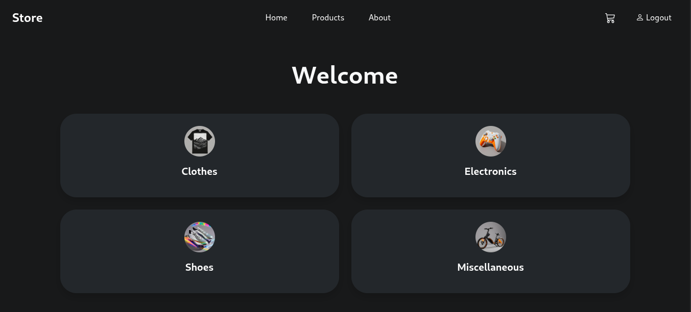
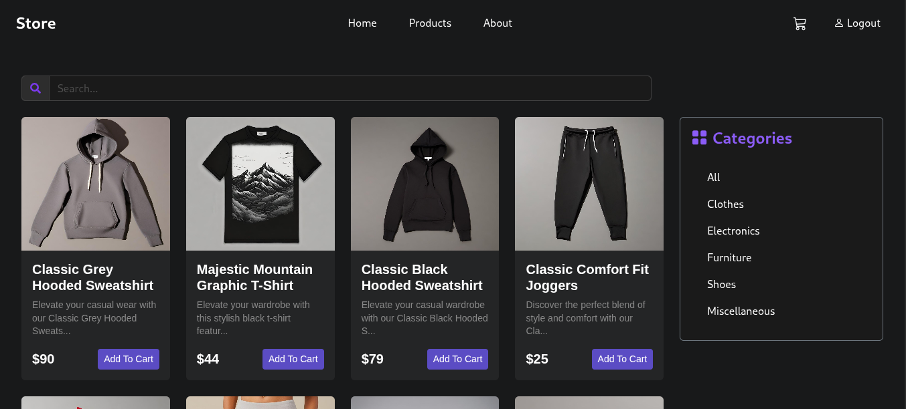
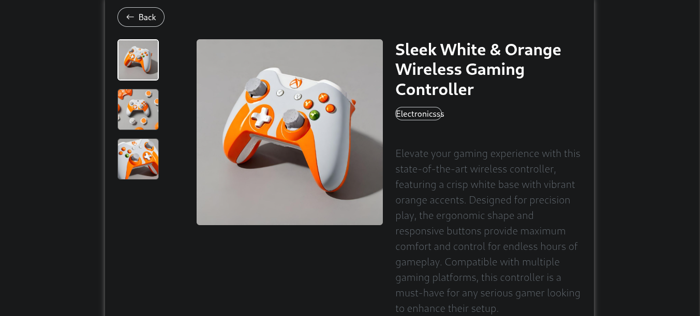
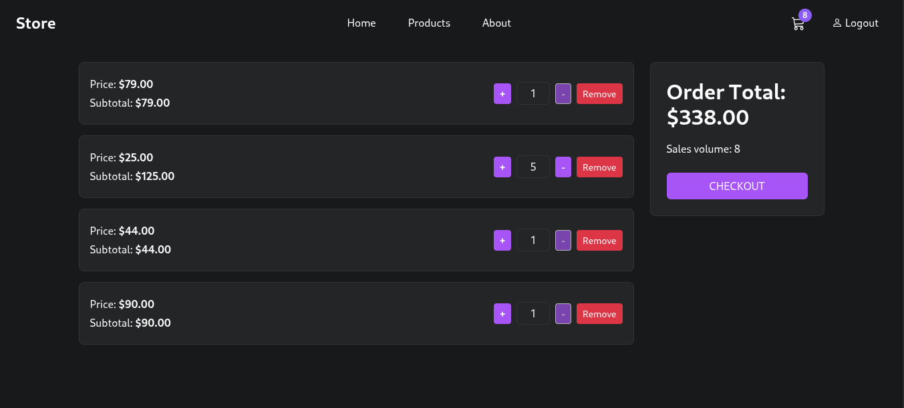

# 🛍️ Store


[](https://kerlosgirgis.github.io/store/home)

**Store** is a sleek and responsive e-commerce web application built with React and Vite. It offers a smooth shopping experience with product browsing, cart management, and a modern UI.

<!--  Replace this with actual screenshot URL -->

---

## 📸 Screenshots

| Home Page                           | Movie Details                        |
|------------------------------------|--------------------------------------|
|  |  |
|  |  |


## 🚀 Features

- 🛒 Browse a variety of products with images, prices, and descriptions.
- ➕ Add or remove items from the shopping cart.
- 📄 View detailed information for each product.
- 📱 Responsive design for desktop and mobile.
- 🔁 Smooth client-side routing with `react-router-dom`.

---

## 🛠️ Technologies Used

- [React](https://reactjs.org/) (v18)
- [Vite](https://vitejs.dev/)
- [React Router DOM](https://reactrouter.com/)
- Bootstrap 5
- TSX

---

## 📁 Folder Structure

```bash
store/
├── public/
├── src/
│   ├── components/
│   ├── pages/
│   ├── assets/
│   ├── App.jsx
│   └── main.jsx
├── package.json
└── README.md
```
## 👤 Author
- Developed with ❤️ by :-
   Kerlos Amir , Ahmed Abd El Kawi , Mohammed Khammes , Fatma Gomaa , Aya Ashreey
